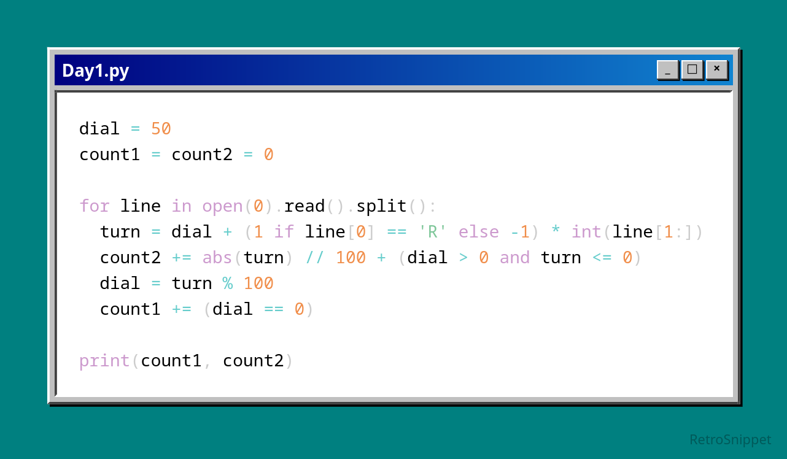

# Day 01

Advent of Code is back, pretty simple start here, here's hoping the difficulty ramps up faster considering the now shorter timeframe of the event.

Part1 is simple enough, just apply the rotation, modulo, and see if the dial is 0 after each rotation

Part2 can be done bruteforced quite trivially, by applying each rotation as a set of single increments or decrements, but it can also be done much faster by just applying the whole rotation, storing the result into a separate variable and then comparing the values before and after the rotation to see how many times 0 would have been crossed (if at all)

Both parts can also be completed together very seamlessly, since the rotation is done the same way, just add Part1's check after the rotation in Part2, since the rotation logic is identical.

Python - input

real	0m0.010s
user	0m0.008s
sys	0m0.002s

Python - bigboy

real	0m2.273s
user	0m2.164s
sys	0m0.083s

C++ - input

real	0m0.003s
user	0m0.003s
sys	0m0.000s

C++ - bigboy

real	0m2.997s
user	0m2.841s
sys	0m0.147s

