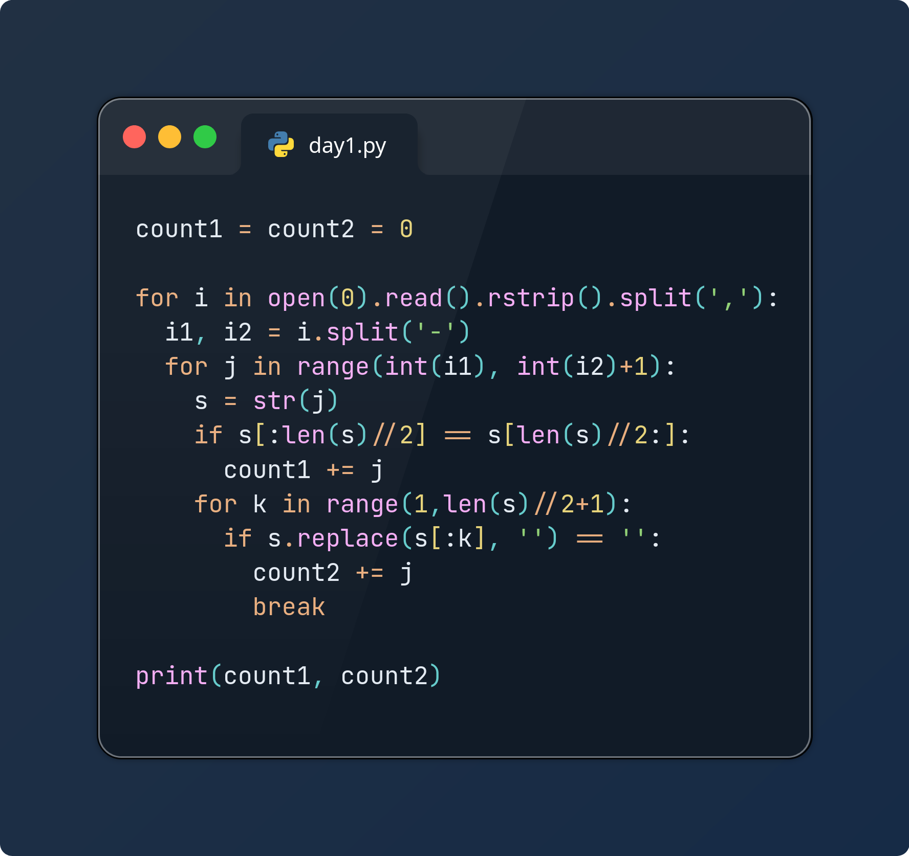

# Day 02

About as big of a ramp up in difficulty as I anticipated, definitely feels like a day 3 or even 4 from previous years.

Part 1 was quite simple, just divide the string in two and compare them

Part 2 required a complete refactoring, and I had to reason it from base cases (writing code for checking increments of 1, then 2, then 3, and using those to reason a wrapping for loop to automate the process for an arbitrary input length)

After the brute force, I explored a more elegant solution of attempting to remove the first k characters from the number as a string, using .replace(), and comparing the result with an empty string. This will eliminate the string entirely if it contains just the repeating values from the first k characters. I was also able to loop through such that I can count for Part1 as well, like on day 1.

Python - input

real	0m0.861s
user	0m0.857s
sys	    0m0.002s
