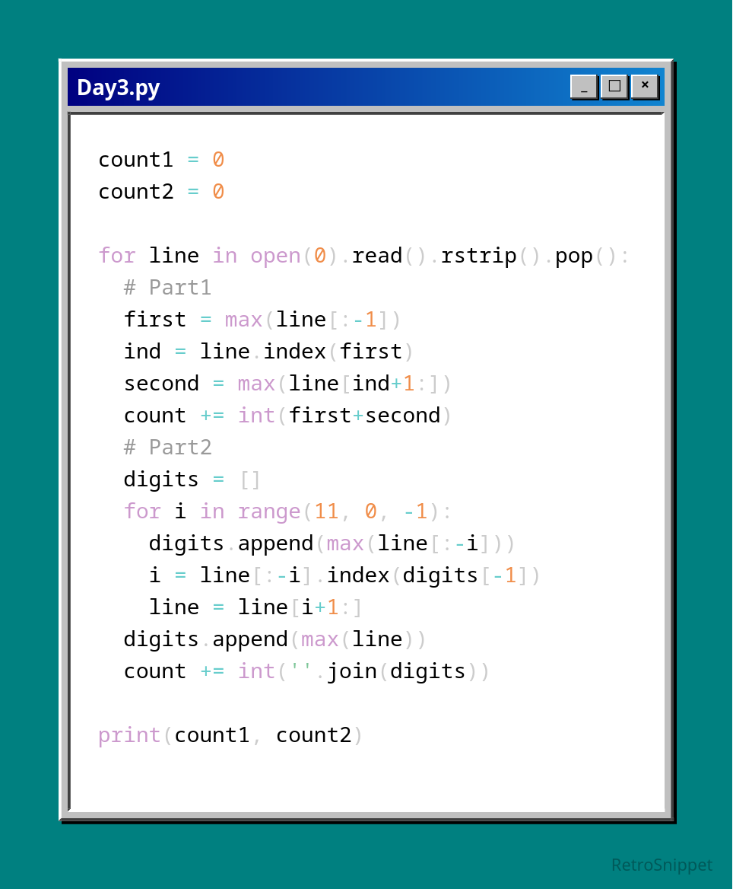

# Day 03

Part 1 seemed really easy here, and sure enough it was. I already predicted that part2 would involve just adding more potential batteries, so to future proof myself at least a little but I restrained myself from using nested for loops (since that would eventually become way too cumbersome and bruteforce-y for my predicted part 2). Instead, it was pretty simple to just find the largest number excluding the last (since it would have the higher order of magnitude, it takes precedence over all other digits unless that digit is the last option in which case it isn't a valid choice for the tens place) and then find the largest value to the right of that for the ones place.

Part 2 ended up being exactly what I predicted; now more batteries must be selected per row, but thankfully my existing approach can just be expanded. Find the largest value from the valid choices (aka those that exclude the last 11 places, since if we choose them we won't have enough batteries left for the rest of the choices), remove everything before it, and continue, just exploring from the first battery chosen up to now excluding the last 10 places, rinse and repeat until 12 choices have been made.

Python - input

real	0m0.010s
user	0m0.010s
sys	0m0.000s
