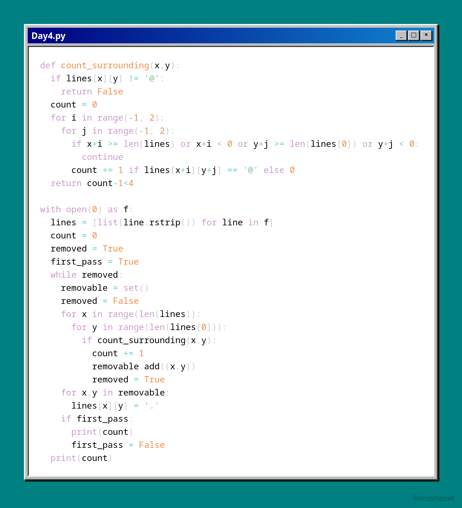
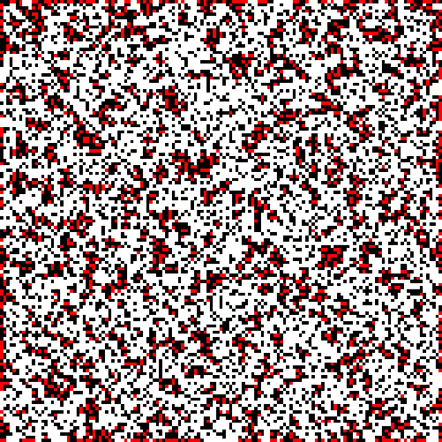

# Day 4

Part 1 is fairly simple, I wasted some time by implementing wrapping logic (as in, using modulo to detect rolls that wrap around the edges) because I misunderstood the problem, but aside from that it's fairly trivial to check surrounding spaces, just have to avoid overflows.

Part 2 was a fun one, I implemented a hashmap (though a list would likely work just as well) that would keep track of 'to be removed' rolls, then removed them after going through the entire room, and looped until I never removed one.

I decided to create a visualization since I think this problem lends itself nicely to one; I added code that would generate a frame for each iteration in part 2, highlighting the set-to-be-removed rolls, and used some ffmpeg commands to generate a gif from them. I think it looks pretty good!

Python - input

real	0m0.249s
user	0m0.246s
sys	0m0.002s

